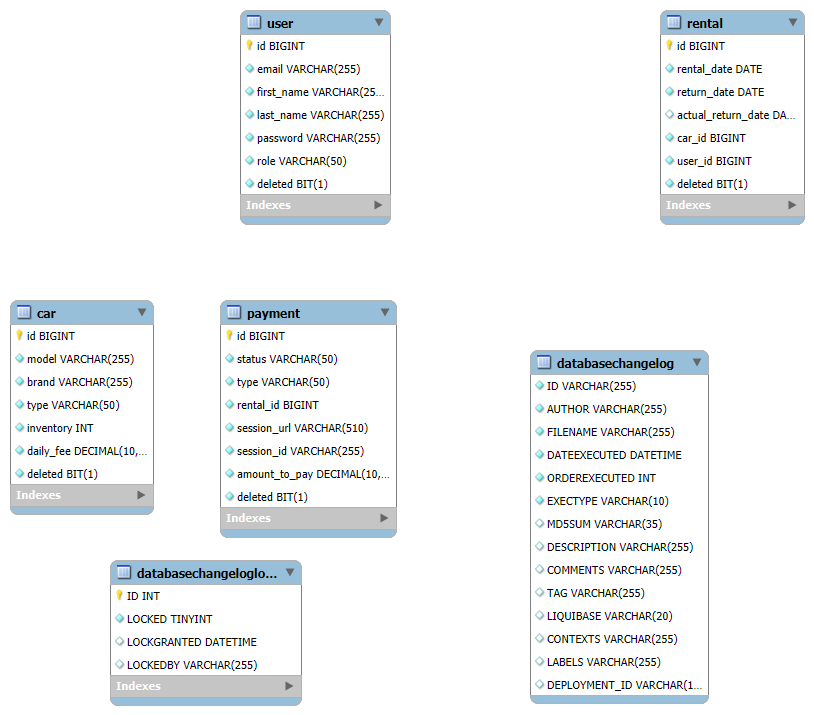

# JV Car Sharing Service

The **JV Car Sharing Service API** is a backend application that provides an API for managing car rentals, users, payments, and authentication in a car-sharing service. This project is designed to make car-sharing services easy to manage by offering set of API interfaces that support CRUD (Create, Read, Update, Delete) operations and secure authentication.

## Video
You can wach how work my API
[Watch it on YouTube](https://www.youtube.com/watch?v=TABxLtpBEq0)

## Technologies and Tools

This project utilizes a range of modern technologies and tools to create a secure, efficient, and scalable API:

- **Spring Boot 3.3.2** - Facilitates rapid development of Java applications with minimal configuration.
- **Spring Security 6.3.2** - Ensures secure access to the API through authentication and authorization.
- **Spring Data JPA** - Simplifies data management with the Java Persistence API.
- **Swagger (Springdoc OpenAPI)** - Automatically generates API documentation.
- **MapStruct** - Facilitates the mapping of DTO objects within the application.
- **JWT (JSON Web Token)** - Implements JWT tokens for secure authentication.
- **Liquibase** - Manages database migrations and schema versioning.
- **Hibernate Validator** - Validates input data.
- **Testcontainers** - Creates isolated testing environments using Docker containers.
- **H2 Database** - Used for testing purposes.
- **MySQL** - Used as the production database.
- **Lombok** - Reduces boilerplate code by automatically generating getters, setters, and other methods.
- **Checkstyle** - Ensures code compliance with coding standards.

## Architecture Overview

The controllers in this application are designed with usability and security in mind:

- **Authentication Service:** Handles user registration, login, and JWT token generation.
- **User Management Service:** Manages user profiles and roles.
- **Car Inventory Service:** Manages CRUD operations for cars.
- **Rental Management Service:** Handles car rentals, including tracking rental status and managing inventory counts.
- **Payment Service:** Integrates with Stripe for payment processing.
- **Notification Service:** Sends notifications via Telegram to administrators.

### API Controllers

## Authentication Controller

- **POST** `/auth/register` - Register a new user.
- **POST** `/auth/login` - Authenticate the user and obtain JWT tokens.

## Users Controller

- **PUT** `/users/{id}/role` - Update a user's role.
- **GET** `/users/me` - Retrieve the authenticated user's profile information.
- **PUT/PATCH** `/users/me` - Update the authenticated user's profile information.

## Cars Controller

- **POST** `/cars` - Add a new car (Manager only).
- **GET** `/cars` - Get a list of all available cars.
- **GET** `/cars/{id}` - Get detailed information about a specific car.
- **PUT** `/cars/{id}` - Update details of a car (Manager only).
- **DELETE** `/cars/{id}` - Delete a car (Manager only).

## Rentals Controller

- **POST** `/rentals` - Add a new rental.
- **GET** `/rentals` - Get a list of rentals by user ID and rental status (Manager only).
- **GET** `/rentals/{id}` - Get specific rental details (Manager only).
- **POST** `/rentals/{id}/return` - Return a rental.

## Payments Controller

- **GET** `/payments` - Get a list of payments by user ID (Manager only).
- **POST** `/payments` - Create a new payment session.
- **GET** `/payments/success/{sessionId}` - Check the success of a Stripe payment.
- **GET** `/payments/cancel/{sessionId}` - Return a paused payment message.

## Data Models

### 1. Car
- **Model:** String
- **Brand:** String
- **Type:** Enum: SEDAN | SUV | HATCHBACK | UNIVERSAL
- **Inventory:** int (number of cars available)
- **Daily Fee:** decimal (in $USD)

### 2. User (Customer)
- **Email:** String
- **First Name:** String
- **Last Name:** String
- **Password:** String
- **Role:** Enum: MANAGER | CUSTOMER

### 3. Rental
- **Rental Date:** LocalDate
- **Return Date:** LocalDate
- **Actual Return Date:** LocalDate
- **Car ID:** Long
- **User ID:** Long

### 4. Payment
- **Status:** Enum: PENDING | PAID
- **Type:** Enum: PAYMENT | FINE
- **Rental ID:** Long
- **Session URL:** String (URL for the payment session with Stripe)
- **Session ID:** String (ID of the payment session)
- **Amount to Pay:** decimal (in $USD)

## Configuration Instructions

### Prerequisites

- Java 17
- Docker

### Setup Steps

1. Check if you have Git installed: `git --version`
2. Clone the repository using SSH: `git clone git@github.com:...`
3. Alternatively, use HTTPS: `git clone https://...`
4. Navigate into the cloned repository: `cd jv-car-sharing-service`
5. (Optional) Check the repository status: `git status`

### Build the project:
./mvnw clean package

### Start the project:
 **Start Docker**: Make sure Docker is up and running before you proceed with the setup.

### After starting the application, the API documentation will be available at:
- http://localhost:8080/swagger-ui.html - when you run app from intelij IDEA
- http://localhost:8081/swagger-ui.html - when you run app from docker

## Login Credentials For Default Users

### MANAGER:

Email: admin@admin.com
Password: password

### User:

Email: customer@customer.com
Password: password

## Application 

- **Developer**: Bartosz Wójcik
